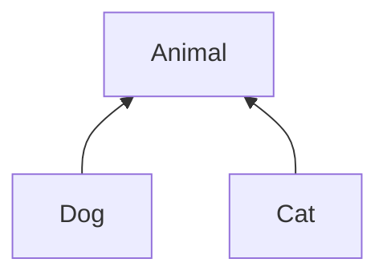
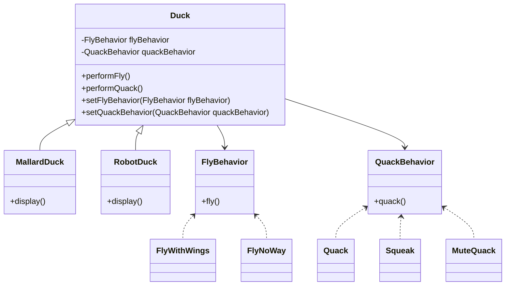

# Project Principle
    
### 1. Pick up what changes and encapsulate them so that the changes do not affect other code.

In our Duck example, what is constantly changing? the flying and quacking behavior, right? 
So let's take this out from the Duck parent.

### 2. Program for an interface, not for an implementation

Let's see one example:

#### Programming to an implementation would be:

Dog d = new Dog();
d.bark();

Cat c = new Cat();
c.meow();

#### Programming to an interface/supertype would be:

Animal animal = new Dog();
animal.makeSound();

##### ...or even better:

Animal animal = getAnimal();
animal.makeSound();

### 3. Give priority to composition over inheritance 

- \"...has one...\" is much better than \"...is one...\" 

--------------------------------------

## Duck sim solution using Strategy pattern

We simply took what changes and encapsulated them so that the changes do not affect other code. Now the
supertype Duck has one FlyBehavior and one QuackBehavior, and the implementations (children) of Duck decide how
will do such things, setting up their fly and quack behaviors.

--------------------------------------

"Strategy is a behavioral design pattern that lets you define a family of algorithms, put each of them into a separate class, and make their objects interchangeable."
(https://refactoring.guru/design-patterns/strategy)