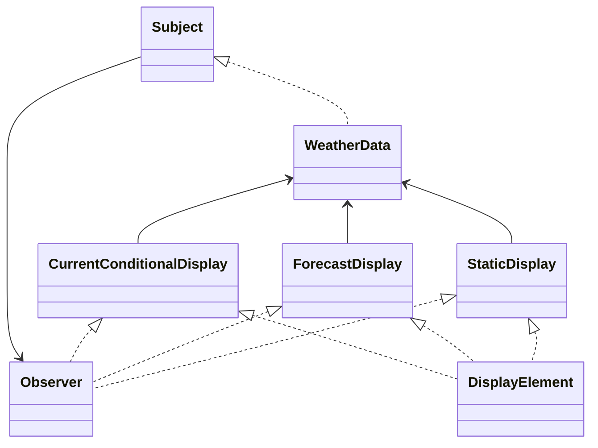

# OO Project Principle
    
###  Rather loosely coupled project is better than a tightly coupled one. 

Classes or objects which interacts each other should be loosely coupled (know very less about each other).

--------------------------------------

## Weather Station solution using Observer pattern

We kept taking what changes constantly and separate it (encapsulating) apart...

--------------------------------------

"Observer is a behavioral design pattern that lets you define a subscription mechanism to notify multiple objects about any events that happen to the object they’re observing."
(https://refactoring.guru/design-patterns/observer)